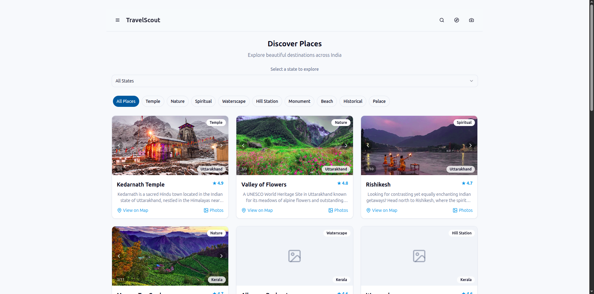
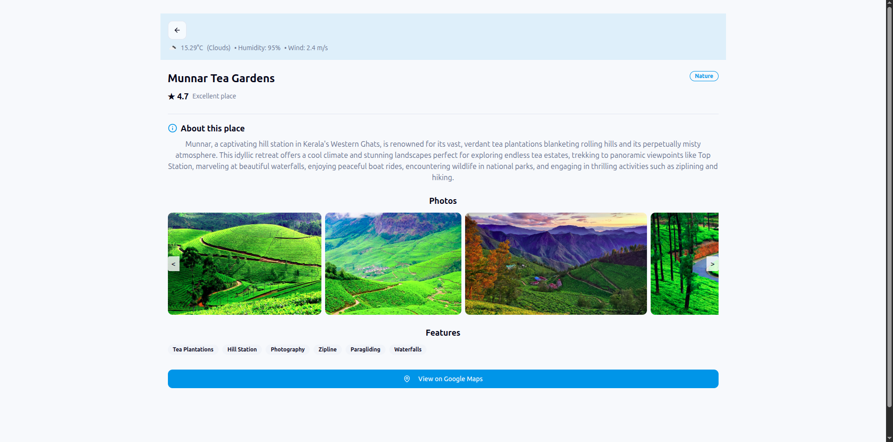

# TravelScout

> 🚧 **Work In Progress:**  
> TravelScout is under active development and not yet deployed. Features and content are being added regularly. If you’d like to contribute, check out the roadmap and open issues!

TravelScout is your one-stop platform for exploring India's most famous tourist destinations. Discover top places to visit in every Indian state, complete with beautiful images, up-to-date weather information, and essential details like opening/closing times and the best time to visit. Whether you're planning your next adventure or just exploring from home, our platform helps you find inspiration and practical information for your journeys.




---

## ⭐ Support Us

If you find this project helpful, please consider giving us a ⭐ star on GitHub! Your support helps us grow and motivates us to keep improving TravelScout.

---

## Getting Started

After cloning the repository, follow these steps to run the project locally:

```bash
npm i
npm run build
npm run dev
```

The application will be available at `http://localhost:3000` (or the port specified in your terminal).

---

## Contributing to TravelScout

We welcome contributions from everyone to help make TravelScout the best resource for exploring India's top tourist destinations! Here are some great ways you can contribute:

### Tasks You Can Help With

- **Update Photos:** Add or update high-quality photos for each tourist place.
- **Improve Descriptions:** Enhance or correct the descriptions for any listed destinations.
- **Suggest New Places:** Propose new places to visit—include their photos and a detailed description.
- **Add Details:** Fill in missing information such as opening and closing times, and the best time to visit each place.
- **Fact Checking:** Verify the accuracy of existing data (location, weather, timings, etc.).
- **UI/UX Improvements:** Suggest or implement improvements to the user experience or interface.
- **Bug Fixes:** Report and fix any issues you find in the application.

### How to Contribute

1. **Pick a Task:** Choose one or more tasks from the list above.
2. **Create a Branch:**  
   Name your branch based on the task you’re working on (e.g., `update-photos-goa`, `add-description-tajmahal`, `suggest-new-place-mysore-palace`).
3. **Make Your Changes:**  
   - For content updates, add or edit photos and descriptions as needed.
   - For new places, provide a name, photos, a detailed description, location, opening/closing times, and the best time to visit.
4. **Commit and Push:**  
   Commit your changes to your branch and push to your fork of the repository.
5. **Create a Pull Request:**  
   Open a pull request to the main repository, clearly describing what you’ve contributed.

## 🌟 Coming Soon

- Live website demo
- User accounts and contributions
- More detailed travel guides

---

### Need Help?

If you have an idea or want to discuss a contribution before starting, feel free to open a discussion or issue.

**Thank you for helping make TravelScout better for everyone!**
